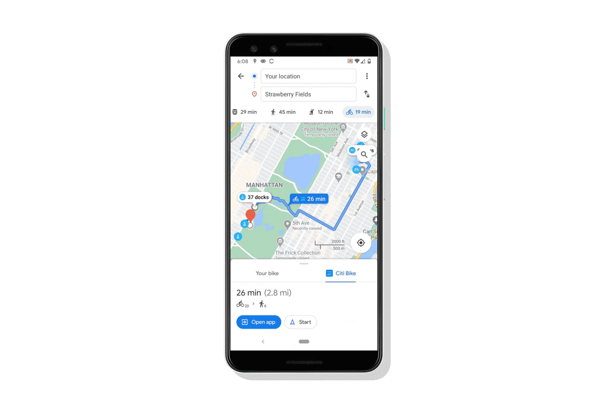
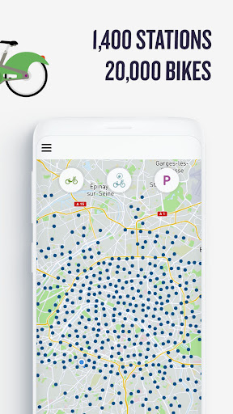

## {.fullbleed background-color="#fcfcfc"}

::: {.fullbleed-wrap}
<div id="velib-player"></div>
:::

```{=html}
<script src="assets/velib-demo.js"></script>
```

## The last few minutes are the problem {background-color="#fcfcfc"}

::: {.columns}

::: {.column width="58%"}
When I unlock a Vélib, I already know where I'm going — I don't route from my front door. The riding is easy.

The part no app answers is the **last few minutes**: near my destination, which dock has a free spot right now — and once I've locked the bike, which way do I walk?
:::

::: {.column width="42%"}
{width="90%" style="border-radius:12px;"}

<span class="muted" style="font-size:.6em">…me, circling the block for an open dock.</span>
:::

:::

## Every app plans the whole trip up front

::: {.columns}

::: {.column width="50%"}
{fig-align="center" style="max-height:470px; width:auto; border-radius:12px; border:1px solid #e6e6e6;"}

<span class="muted" style="font-size:.55em">Google Maps: walk → ride → walk, routed from your front door.</span>
:::

::: {.column width="50%"}
{fig-align="center" style="max-height:470px; width:auto; border-radius:12px; border:1px solid #e6e6e6;"}

<span class="muted" style="font-size:.55em">The Vélib app: 1,400 stations — but which one near you is free *now*?</span>
:::

:::

::: {style="font-size:.72em"}
Both assume you're on foot from the start and plan the route before you move. My app skips the plan: by default the compass points to the **nearest free dock**, and once you park, it turns to point at the **door**.
:::


## Two feeds — that's the whole backend

Framed as coordinates, it shrinks: I need to know where the open docks are, and where the person is standing.

::: {.cards}

::: {.card}
[🚲 Vélib live feed · opendata.paris.fr]{.card-title}

<pre style="font-size:.5em; background:#f4f7f9; border-radius:8px; padding:.7em; margin:.3em 0; overflow:auto;">{
  "name": "Vieille du Temple – Francs Bourgeois",
  "numdocksavailable": 14,
  "capacity": 35,
  "coordonnees_geo": { "lat": 48.858, "lon": 2.358 }
}</pre>

<span class="muted" style="font-size:.62em">1,500+ stations, refreshed live.</span>
:::

::: {.card}
[📍 Google Geocoding API]{.card-title}

<pre style="font-size:.5em; background:#f4f7f9; border-radius:8px; padding:.7em; margin:.3em 0; overflow:auto;">{
  "formatted_address": "21 Rue des Gravilliers, 75003 Paris",
  "geometry": { "location": { "lat": 48.8637, "lng": 2.3569 } },
  "status": "OK"
}</pre>

<span class="muted" style="font-size:.62em">Turns a spoken or typed address into lat / lng.</span>
:::

:::

::: {style="font-size:.72em"}
Everything else — nearest dock, distance, bearing — is arithmetic on two lists of coordinates.
:::

## The phone does the arithmetic; the server only geocodes

```{mermaid}
flowchart LR
  A["📱 iPhone (React SPA)"] -->|"address string"| B["FastAPI /api/location/geocode"]
  B -->|"lat, lng"| A
  A -->|"haversine + bearing<br/>vs. live docks"| A
  A -->|"webkitCompassHeading"| N["🧭 needle = bearing − heading"]
  subgraph Client [runs entirely on device]
    A
    N
  end
  style Client fill:#DEEBF7,stroke:#2b8cbe
```

::: {style="font-size:.7em"}
The only thing that ever leaves the phone is the address. Choosing the nearest dock and turning the compass both happen on the device — which keeps it fast and, almost by accident, private.
:::

## Finding the nearest free dock, live

<div id="pmap" style="height:620px; border-radius:10px; border:1px solid #e6e6e6;"></div>

```{=html}
<script>
(function () {
  var dest = {name:"21 rue des Gravilliers", lat:48.8637, lng:2.3569};
  var FEED = "https://opendata.paris.fr/api/explore/v2.1/catalog/datasets/velib-disponibilite-en-temps-reel/records"
    + "?limit=80&select=name,numdocksavailable,coordonnees_geo"
    + "&where=" + encodeURIComponent("numdocksavailable > 0 AND within_distance(coordonnees_geo, geom'POINT(2.3569 48.8637)', 900m)");

  // Real stations near the destination — silent fallback if the network is down on stage.
  var FALLBACK = [
    {name:"Caire - Dussoubs", lat:48.86785, lng:2.34936, docks:32},
    {name:"Porte Saint-Martin", lat:48.86860, lng:2.35570, docks:27},
    {name:"Vieille du Temple - Francs Bourgeois", lat:48.85826, lng:2.35822, docks:14},
    {name:"Greneta - Sébastopol", lat:48.86524, lng:2.35167, docks:13},
    {name:"Cossonnerie - Sébastopol", lat:48.86133, lng:2.34942, docks:9},
    {name:"Grande Truanderie - Saint-Denis", lat:48.86263, lng:2.34981, docks:6},
    {name:"Place Pasdeloup", lat:48.86265, lng:2.36703, docks:1}
  ];

  function haversine(a, b) {
    var R=6371000, toRad=Math.PI/180;
    var dLat=(b.lat-a.lat)*toRad, dLng=(b.lng-a.lng)*toRad;
    var s=Math.sin(dLat/2)*Math.sin(dLat/2) + Math.cos(a.lat*toRad)*Math.cos(b.lat*toRad)*Math.sin(dLng/2)*Math.sin(dLng/2);
    return 2*R*Math.asin(Math.sqrt(s));
  }

  var map = null, loaded = false;

  function ensureMap() {
    if (map || typeof L === "undefined" || !document.getElementById("pmap")) return;
    map = L.map("pmap", {scrollWheelZoom:false}).setView([dest.lat, dest.lng], 15);
    L.tileLayer("https://{s}.tile.openstreetmap.org/{z}/{x}/{y}.png",
      {attribution:"© OpenStreetMap", maxZoom:19}).addTo(map);
    L.marker([dest.lat,dest.lng]).addTo(map)
      .bindTooltip("🎯 " + dest.name, {permanent:true, direction:"top"});
    setTimeout(function(){ map.invalidateSize(); }, 200);
  }

  function render(stations) {
    var nearest=null, best=Infinity;
    stations.forEach(function(s){ var d=haversine(dest,s); if(d<best){best=d; nearest=s;} });
    stations.forEach(function(s){
      var isNear = s===nearest;
      L.circleMarker([s.lat,s.lng], {
        radius:isNear?11:6,
        color:isNear?"#469408":"#2b8cbe",
        weight:isNear?3:1, fillColor:isNear?"#469408":"#2b8cbe",
        fillOpacity:isNear?0.9:0.55
      }).addTo(map).bindTooltip(s.name + " · " + s.docks + " docks"
        + (isNear?" — nearest ("+Math.round(best)+" m)":""));
    });
    if (nearest) {
      L.polyline([[dest.lat,dest.lng],[nearest.lat,nearest.lng]],
        {color:"#469408", weight:3, dashArray:"6 6"}).addTo(map);
    }
    setTimeout(function(){ map.invalidateSize(); }, 150);
  }

  function badge(text) {
    var b = document.getElementById("feed-badge");
    if (b) b.textContent = text;
  }

  function load() {
    ensureMap();
    if (!map || loaded) return;
    loaded = true;
    fetch(FEED).then(function(r){ return r.json(); }).then(function(d){
      var st = (d.results||[])
        .filter(function(r){ return r.coordonnees_geo; })
        .map(function(r){ return {name:r.name, docks:r.numdocksavailable,
                                  lat:r.coordonnees_geo.lat, lng:r.coordonnees_geo.lon}; });
      if (!st.length) throw new Error("empty");
      render(st);
      badge("live · " + st.length + " stations with a free dock within 900 m");
    }).catch(function(){
      render(FALLBACK);
      badge("offline fallback");
    });
  }

  if (document.readyState !== "loading") load();
  else document.addEventListener("DOMContentLoaded", load);
  if (window.Reveal) {
    Reveal.on("ready", function(){ load(); if(map) map.invalidateSize(); });
    Reveal.on("slidechanged", function(){ load(); if(map) setTimeout(function(){map.invalidateSize();},150); });
  }
})();
</script>
```

::: {style="font-size:.6em"}
Destination 21 rue des Gravilliers. Green is the nearest open dock, blue the rest — fetched live from <span id="feed-badge">opendata.paris.fr</span>. This is the same haversine that runs on the phone.
:::

## Getting a true-north compass out of an iPhone

::: {.columns}

::: {.column width="52%"}
```js
// Must be called *inside* a user gesture (a button tap)
await DeviceOrientationEvent.requestPermission();

function onOrient(e) {
  // iOS: this is TRUE north, clockwise.
  // NOT e.alpha (relative + inverted).
  const heading = e.webkitCompassHeading
                ?? (360 - e.alpha);   // Android
}
```
:::

::: {.column width="48%"}
This quietly cost me an afternoon. Three ways to get nothing: without HTTPS the sensors are blocked; ask for permission on page load and iOS ignores it, because it needs a real tap; and `e.alpha` gives an arbitrary origin, not north.

The fix: an "Enable Compass" button that calls `requestPermission()` on the tap, then reads `webkitCompassHeading`.
:::

:::

## One container on Cloud Run, and HTTPS comes free

```{mermaid}
flowchart LR
  S["git push"] --> CB["Cloud Build"]
  CB --> IMG["Artifact Registry<br/>single image"]
  IMG --> CR["Cloud Run<br/>europe-west9 · HTTPS"]
  CR --> P["📱 *.run.app"]
  SM["Secret Manager<br/>Mistral · Geocoding"] -.-> CR
  style CR fill:#DEEBF7,stroke:#2b8cbe
```

::: {style="font-size:.68em"}
One image: FastAPI serves both the built React app and the API from a single origin, so there's no CORS to fight, and every `*.run.app` URL is HTTPS by default — exactly what the iPhone compass insists on. Keys stay in Secret Manager.
:::

## Three ways in, then you just follow the needle

::: {.columns}

::: {.column width="55%"}
Reach a destination three ways: **speak** it — Mistral Vox transcribes and a Mistral model pulls the address out — **type** it into the sidebar, or hit **demo**.

From there the compass points at the nearest open dock. Tap "Parked" and the needle flips toward your actual destination. Your position updates live through `watchPosition`.
:::

::: {.column width="45%"}
<iframe src="https://velib-app-c3eayx2yta-od.a.run.app"
        style="width:360px; height:640px; border:10px solid #222; border-radius:34px; background:#fff;"
        loading="lazy"></iframe>
:::

:::

## Try it now {background-color="#fcfcfc"}

::: {.columns}

::: {.column width="55%"}
It's live today — one container on Cloud Run, HTTPS, real geocoding, a working iOS compass, and voice, typed, and demo input all in place.

Now on the **live** Vélib feed. Next: rank docks by walking time instead of straight-line distance, and make it an installable app with offline map tiles.

<span class="muted" style="font-size:.7em">Merci — questions?</span>
:::

::: {.column width="45%"}
::: {style="text-align:center;"}
{width="62%"}

<span class="big-num" style="font-size:.55em">velib-app…run.app</span><br/>
<span class="muted" style="font-size:.6em">Point your camera here to try it on your phone.</span>
:::
:::

:::
